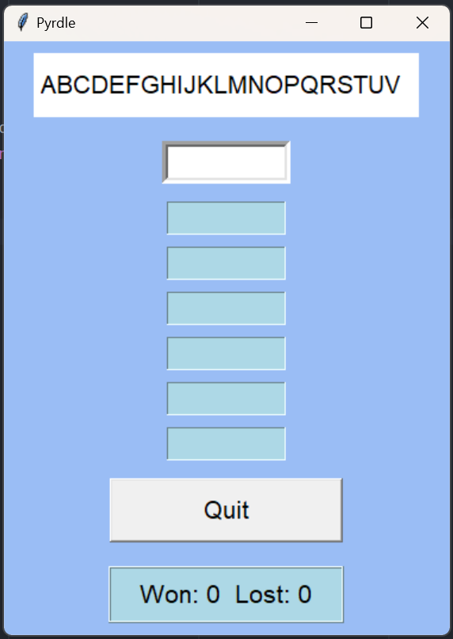
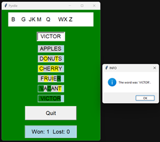
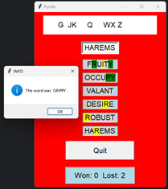

# Pyrdle

#### Video Demo:  <URL HERE>
#### Description: A python version of wordle
#### Author: Tom Legrady     Tom@TomLegrady.com
#### Date: January, 2024
## Copyright: You are welcome to use my program however you wish. Remember the real wordle game is owned by NY. Y. Times.

This program is an implementation of the popular game *wordle* using `Python`
and `Tcl/Tk` I am new to Python, and chose this project to improve my skills.

The game consists of three files, with test file suitable for `pytest`:

* config.py - The constants used in the program.
* game_tk.py - The Tcl/Tk `gui` components ... the `view` of the program.
* pyrdle.py - The game logic ... the `model` and `controller` components.
* test_config.py - tests for the constants.
* test_game_tk.py - tests for the `gui` components.
* test_pyrdle.py - tests for the game logic.

`pyrdle.py` consists of a single class, `Game1`, and a block to initiate the program.
`game_tk.p` contains `gui` components sub-classed from `Tcl/Tk`. `config.y`
holds the constans used in the other two files.
When `pyrdle.py` is run, a `Game` class object is constructed, and the `mainloop`
method is invoked, which passes control to `Tk`.

The game-board displays the alphabet at the top. As the player makes guesses at
the secret word, the letters in their guesses are removed from the alphabet.
Below the alphabet is an `entry box`, where the player types. Next come six
evaluation boxes, followed by a `Quit` button, below which is the score display.

Part of constructing the game board involves requesting a word from the `Random Word API`.
The web site allows a query to ask for random words. Query arguments control
the language of the words that are returned, the number of words, and their length.

As the player types each letter into the entry box, the characters are validated.
Lower case letters are converted to upper case. Numbers and punctuation are simply
ignored.

When the player presses the `return` key at the end of a guess,
The word is copied to the evaluation box. Letters that are in the same position
in the secret word are displayed with a green
background; letters that appear in the secret word but in a different position
appear with a yellow background, while a
light grey background indicates letters
which are not in the secret word. There are six boxes for the six guesses, though
the last one is never used. After the sixth guess, either the play has won the
game, or run out of guesses, resulting in a loss. But the remaining sixth evaluation
box indicates to the user they still have a guess available.

When the player runs out of guesses, or when they come up with the right
word, the game-board background switches to red for a loss or green for a
win. The secret word is displayed in a popup window. pressing the `OK`
button or pressing the `enter` key causes the popup to go away and the game
board resets for the next game.

At any time, the player can press the `Quit` button, or use the `close` icon
appropriate to their computer system, to terminate the game.

